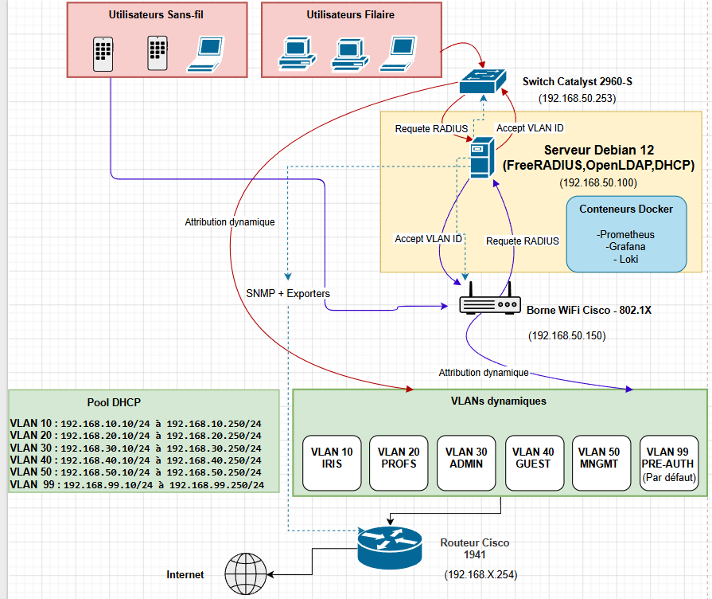

# Dossier de Choix Technique - Migration Souveraine (OpenLDAP / RADIUS)

> **Auteur :** Edib Saoud
> **Date :** 02/03/2026 - 30/04/2026
> **Version :** 1.0
> **Statut :** Validé

---

## 1. Contexte et Problématique

L'infrastructure historique reposait sur des systèmes d'authentification fermés et propriétaires. Pour reprendre le contrôle des données d'identité et s'affranchir des coûts de licence, le groupe Mediaschool a décidé d'opérer une migration souveraine.

La problématique technique était double :
1. **Remplacer l'annuaire et le serveur d'authentification** de manière transparente pour les équipements réseaux Cisco.
2. **Maintenir un haut niveau de visibilité** sur la santé du réseau grâce à une supervision open source moderne.

---

## 2. Choix Technologiques

### 2.1 Socle Système et Identité
- **Système d'exploitation :** Debian 12 (Bookworm). Une distribution libre de référence, très stable pour les serveurs de production.
- **Serveur d'Annuaire :** **OpenLDAP**. La référence absolue en matière d'annuaire libre (LDAP v3), permettant de centraliser les comptes étudiants et professeurs.
- **Serveur d'Authentification :** **FreeRADIUS**. Il remplace le serveur propriétaire pour valider les connexions 802.1X (Wi-Fi/Filaire) en interrogeant la base OpenLDAP.

### 2.2 Stack de Supervision
Afin de monitorer la charge du serveur et l'état des switchs Cisco de manière centralisée, un environnement conteneurisé a été retenu pour sa facilité de déploiement :
- **Moteur :** Docker et Docker Compose.
- **Collecte (Metrics & Logs) :** Prometheus (récupération des données) et Loki (agrégation des journaux).
- **Agents :** Node Exporter (santé du serveur Debian) et exportateur SNMP (interrogation des switchs Cisco).
- **Restitution visuelle :** **Grafana**, pour la création de tableaux de bord (Dashboards).

### 2.3 Paramètres d'Infrastructure
- **IP Serveur (Debian) :** `192.168.50.100` (Sert de serveur RADIUS, LDAP et Grafana).
- **Domaine LDAP :** `dc=iris,dc=local`
- **Clients RADIUS :** Switchs et AP Cisco du LAN existant (`192.168.50.253`, `192.168.50.150`).

---

## 3. Schéma de l'Architecture Globale

Le schéma suivant détaille les interactions entre les équipements réseaux (Cisco), le module RADIUS (FreeRADIUS) qui interroge la base OpenLDAP, et la boucle de supervision Grafana/Prometheus (SNMP).

---

## 4. Analyse des Risques et Atténuation

| Risque Identifié | Impact | Probabilité | Mesure de prévention (Traitement) |
|:---|:---:|:---:|:---|
| **Rupture d'authentification réseau** | Élevé | Moyen | Bascule progressive (un switch à la fois). L'ancien serveur reste disponible en "secondary radius server" sur Cisco. |
| **Incohérence ou perte des comptes LDAP** | Moyen | Faible | Scripts d'exportation/importation validés. Sauvegarde ldif quotidienne avant mise en production. |
| **Absence de supervision pendant la bascule** | Élevé | Moyen | La stack Docker (Grafana) est déployée *avant* la bascule des clients pour monitorer le comportement de FreeRADIUS en direct. |
