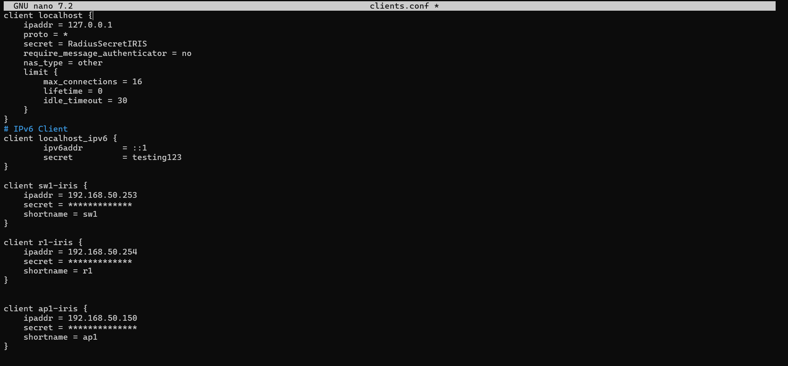
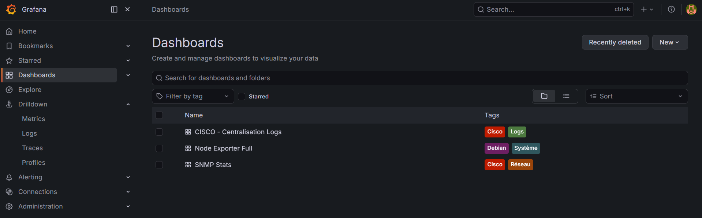

# Procédure d'Installation - FreeRADIUS, OpenLDAP & Supervision Docker

> **Auteur :** Edib Saoud
> **Date :** 02/03/2026 - 30/04/2026
> **Version :** 1.0
> **Statut :** Validé

---

## 1. Préparation du Serveur Debian 12

L'installation de base nécessite un système mis à jour et la configuration d'une IP statique.
```bash
sudo apt update && sudo apt upgrade -y
# L'IP 192.168.50.100 est définie dans /etc/network/interfaces
```

---

## 2. Déploiement de l'Annuaire OpenLDAP

### 2.1 Installation
```bash
sudo apt install slapd ldap-utils -y
```

### 2.2 Configuration du socle
Lancer la reconfiguration pour définir le domaine (ex: `dc=iris,dc=local`) :
```bash
sudo dpkg-reconfigure slapd
```
Création de la structure de base (Unités d'organisation) via un fichier `base.ldif` :
```ldif
dn: ou=Utilisateurs,dc=iris,dc=local
objectClass: organizationalUnit
ou: Utilisateurs

dn: ou=Groupes,dc=iris,dc=local
objectClass: organizationalUnit
ou: Groupes
```
Application du fichier LDAP :
```bash
ldapadd -x -D "cn=admin,dc=iris,dc=local" -W -f base.ldif
```

---

## 3. Déploiement de FreeRADIUS

### 3.1 Installation
```bash
sudo apt install freeradius freeradius-ldap freeradius-utils -y
```

### 3.2 Lier FreeRADIUS à OpenLDAP
1. Activer le module LDAP :
   `sudo ln -s /etc/freeradius/3.0/mods-available/ldap /etc/freeradius/3.0/mods-enabled/`
2. Éditer la configuration LDAP de FreeRADIUS (`/etc/freeradius/3.0/mods-available/ldap`) pour pointer sur `localhost` et l'arbre d'annuaire `dc=iris,dc=local`.

### 3.3 Déclaration des Équipements Cisco (Clients)
Dans le fichier `/etc/freeradius/3.0/clients.conf` :
```text
client cisco-switch {
    ipaddr = 192.168.50.253
    secret = SecretMigrationIRIS!
}
```



### 3.4 Bascule côté Cisco
Se connecter au switch Cisco et modifier l'adresse du serveur RADIUS :
```cisco
configure terminal
radius server RADIUS-LINUX
 address ipv4 192.168.50.100 auth-port 1812 acct-port 1813
 key SecretMigrationIRIS!
```

---

## 4. Déploiement de la Supervision (Docker / Prometheus / Grafana)

Afin de monitorer la santé du serveur et des équipements Cisco via SNMP, nous utilisons Docker.

### 4.1 Installation de Docker
```bash
sudo apt install docker.io docker-compose -y
```

### 4.2 Lancement de la Stack Monitoring
Création d'un répertoire `monitoring` et d'un fichier `docker-compose.yml` contenant Prometheus, Grafana, Loki, et snmp-exporter.

Lancement en arrière-plan :
```bash
cd monitoring
sudo docker-compose up -d
```

### 4.3 Node Exporter & SNMP
- Installation de `prometheus-node-exporter` sur le serveur Debian pour remonter la santé CPU/RAM.
- Activation de l'agent SNMP `v2c` sur les switchs Cisco.

### 4.4 Dashboard Grafana
1. Accéder à l'interface web : `http://192.168.50.100:3000`.
2. Connecter Prometheus comme source de données.
3. Importer les tableaux de bord.


