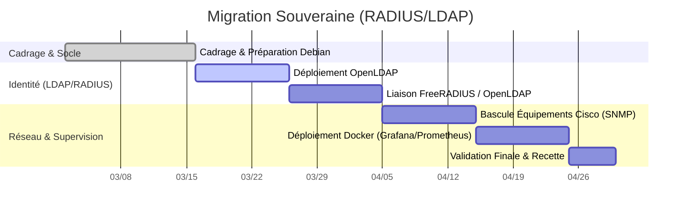

# RP07 - Migration Souveraine Open Source (FreeRADIUS/OpenLDAP)

> 🌐 **Aperçu Visuel :** Retrouvez une présentation illustrée de ce projet sur mon portfolio : [edib16.github.io/Portfolio/#RP07](https://edib16.github.io/Portfolio/#RP07)

> **Auteur :** Edib Saoud
> **Date :** 02/03/2026 - 30/04/2026
> **Contexte :** Projet BTS SIO SISR - IRIS Mediaschool (Mediaschool Group)

## 1. Contexte du Projet

Dans le cadre d'une démarche globale de **souveraineté numérique** initiée par la Direction Technique du groupe Mediaschool, l'infrastructure d'authentification réseau de l'école devait s'affranchir des solutions propriétaires (éditeurs tiers).

L'objectif principal était de migrer l'authentification réseau vers une "Stack Libre" entièrement maîtrisée, reposant sur **OpenLDAP** pour l'annuaire des utilisateurs et **FreeRADIUS** pour le contrôle d'accès. Ce projet inclut également le déploiement d'une stack de supervision complète conteneurisée sous **Docker** (Prometheus, Loki, Grafana) afin d'assurer la continuité de service.

## 2. Sommaire de la Documentation

1. [Dossier de Choix Technique](01_DOSSIER_CHOIX_TECHNIQUE.md) : Analyse de l'existant, choix des outils Open Source et plan d'intégration de la supervision.
2. [Procédure d'Installation](02_PROCEDURE_INSTALLATION.md) : Installation d'OpenLDAP, configuration de FreeRADIUS et déploiement de Docker/Grafana.
3. [Mode Opératoire](03_MODE_OPERATOIRE.md) : Gestion courante de l'annuaire (ajout d'utilisateurs LDAP) et accès aux dashboards Grafana.
4. [Cahier de Recette](04_CAHIER_DE_RECETTE.md) : Validation des connexions depuis les switchs Cisco et vérification de la remontée SNMP.

## 3. Compétences SISR Mobilisées (Blocs BTS SIO)

| Bloc de Compétences | Compétences spécifiques validées dans ce projet | Preuves / Exemples concrets |
|:---|:---|:---|
| **Bloc 1 : Support et mise à disposition de services informatiques** | **Gérer le patrimoine informatique** | Remplacement d'une infrastructure propriétaire par une solution libre (Debian 12). |
| | **Travailler en mode projet** | Conduite du changement, planification de la migration sur 2 mois avec tests de non-régression. |
| | **Mettre à disposition un service informatique** | Déploiement d'un annuaire OpenLDAP, d'un serveur FreeRADIUS et de la supervision Grafana. |

## 4. Planning de Réalisation (Diagramme de Gantt)

La méthode Agile (itérative) a été privilégiée pour s'assurer que l'ancienne authentification reste active pendant le maquettage de la nouvelle.

